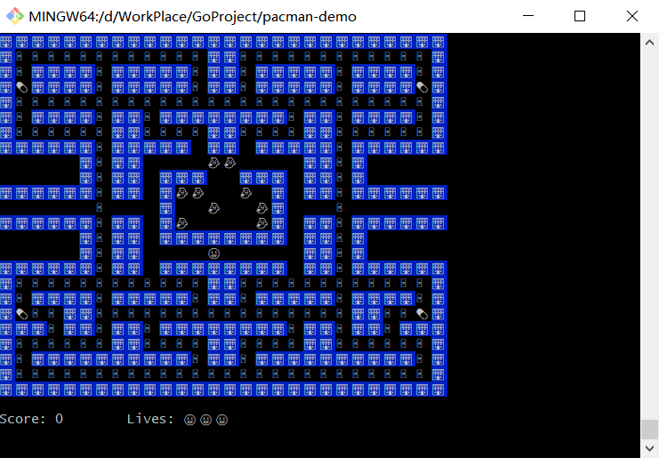

## Pac-Man-go Feature
<<<<<<< HEAD

=======
>>>>>>> refs/remotes/origin/main
# Input and Output
	Load the Maze
	Printing to the Screen
	Updating the game loop
  - Read from a file
  - Print to the standard output
  - Handle multiple return values
  - Handle errors
  - Create and add an element to a slice
  - Range loop over a slice
  - Defer a function call
  - Log errors

# Handing player Input
	Enabling Cbreak Mode
	Restoring Cooked Mode
	Reading from Stdin
	Updating the Game Loop
	Clearing the Screen
  - Work with different terminal modes
  - Calling external commands from Go code
  - Send escape sequences to the terminal
  - Read from standard input
  - Create a function that returns multiple values

# Adding Movement
	Tracking player position
	Handling arrow key presses
	Updating the maze
	Animation
  - Create a struct
  - Use the switch statement
  - Handle the arrow keys
  - Use named return values

# Ghosts
	Making Ghosts
	A very smart AI
	Let's add some movement
  - Create a map (dictionary)
  - Generate random numbers
  - Use pointers

# Game Tips
	Preparation
	Game over
	Game win
  - Use the fallthrough statement in switch blocks
  - Work with slices

# Making things real(time)
	Refactoring the input code
  - Use goroutines
  - Use anonymous functions (lambdas)
  - Use channels
  - Use the select statement to read channels async
  - Use package time

# Emojis
	Load a json
	Adjusting the horizontal displacement
	Replace hardcoded characters with configuration
	Game over and pills
  - Load a json file
  - Print emojis

# Command line parameters
	Create flags for each file
	Replacing the hard coded files with the flags
  - Add flags to a command line application

# Buffer "The String Concatenation Slayer"
	Create Point type and update Player struct to use Point type.
	Update initial `lives` to be greater than 1 and decrement lives on ghost collision
	Update scoreboard to display Player emojis corresponding to number of lives
  - Concatenate strings using a Buffer

# Ghosts with power ups
	Drawing the Pills
	Enable Pill swallowing
	Support simultaneous pill swallowing
	Avoiding Race Conditions
  - Use a timer 
  - When and how to use a Mutex lock
<<<<<<< HEAD

=======
>>>>>>> refs/remotes/origin/main
